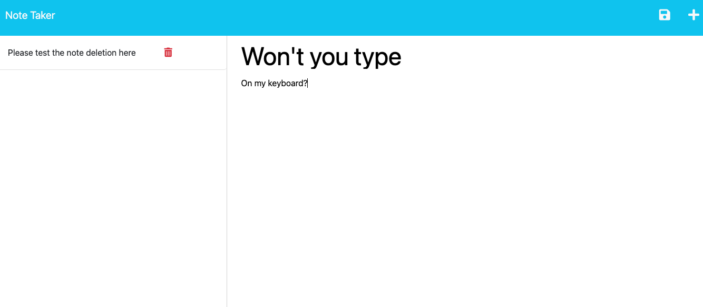
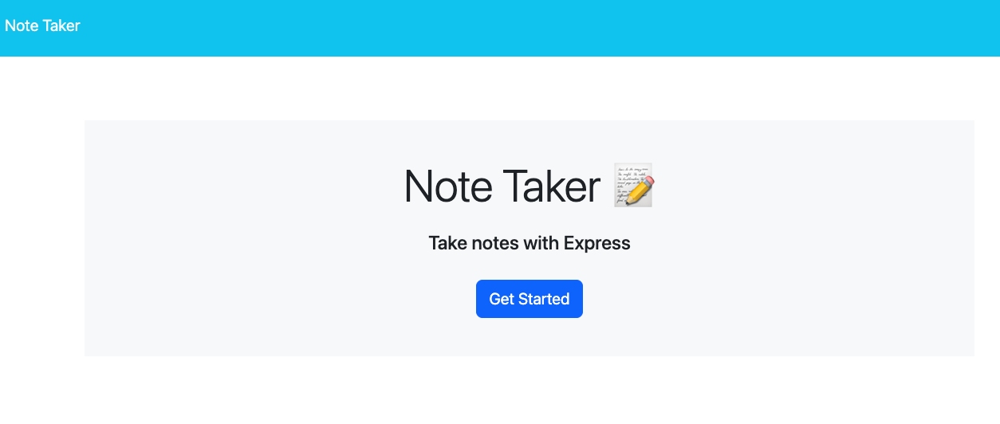
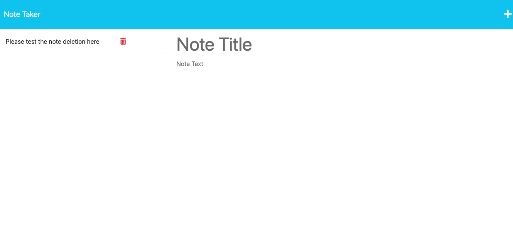
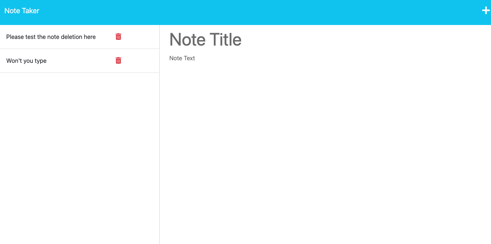

# Take Note: A Web based notes app!
[](https://github.com/DigitallyIntrinsic/takenote/issues) [](https://github.com/DigitallyIntrinsic/takenote/graphs/contributors) 

## Description
This application was designed to give users a place to store notes to help them organize their thoughts and to keep track of tasks they need to complete. It is powered by Express and JavaScript and implements an imitation database using a json file (db.json) to save and retrieve data, through the use of GET, POST, and DELETE requests within Express which allows users to save, retrieve, post new data, and delete data from the application by use of the front end user interface (UI).
          
View the deployed page at [Take Note: A Web based notes app!](https://take-note1-8ef59f971878.herokuapp.com/).
## Contents
* [Installation](#installation)
* [Usage](#usage)
   * [Screenshots](#screenshots)
* [Built With](#built-with)
* [License](#license)
* [Contributing](#contributing)
* [Tests](#tests)
* [Questions](#questions)
* [Credits](#credits)

## Installation
To use this application, please install: 
```
This app requires express, uniqid, and node.js knowledge.
```
  
## Usage
This application is powered by Express. For it to function properly, start the server by doing the following: Navigate to the app directory, install all dependencies (npm i), then type the command npm start. A message should then display in the command line saying "App listening at http://localhost:3001". Once the server is running, navigate to the front end of the application directly from the command line by holding command and clicking the link http://localhost:3001. From there, users can pull up any existing notes saved to the database or create new notes, which will be pushed to the database and saved. 
  
### Screenshots









## Built With

* HTML
* CSS
* JavaScript
* Node.js
* Express.js
  
## License
This application is licensed under the MIT license.
  
## Contributing
There are no contributing guidelines. If you would like to use, please fork as needed and make changes required.
  
## Tests
To run tests on the application, install
```
There is no test unit for this app
```
and run `npm run test` from the command line.
  
## Questions
If you have any questions about the repo, please [open an issue](https://github.com/DigitallyIntrinsic/takenote/issues) or contact me via email at gitboot@1002.us. You can find more of my work on my GitHub, [DigitallyIntrinsic](https://github.com/DigitallyIntrinsic/).
  
## Credits
* [This app was aided by starter code from the bootcamp and chatgpt](https://chat.openai.com/)

  
